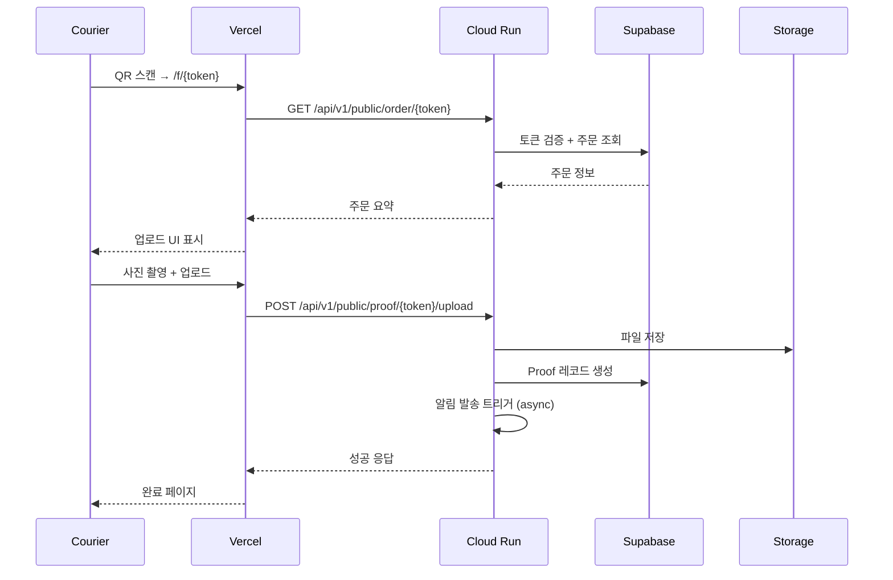
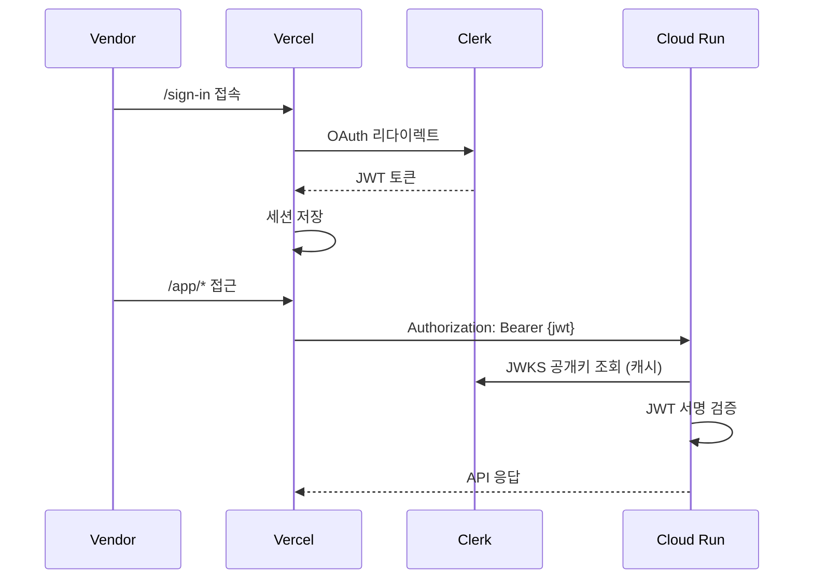

# 00. 시스템 아키텍처 (Architecture)

> **Last Updated**: 2024-12-28
> **Status**: v1.0 Production

---

## 1. 개요

Saegim(새김)은 QR 기반 배송 증빙 플랫폼입니다. 화환/꽃배달 업체가 배송 완료 사진을 찍고, 고객에게 자동으로 알림을 보내는 서비스입니다.

```
┌─────────────────────────────────────────────────────────────────────────┐
│                              SAEGIM ARCHITECTURE                         │
├─────────────────────────────────────────────────────────────────────────┤
│                                                                          │
│   ┌─────────────┐     ┌─────────────┐     ┌─────────────┐              │
│   │   Courier   │     │   Vendor    │     │   Buyer     │              │
│   │  (Mobile)   │     │    (PC)     │     │  (Mobile)   │              │
│   └──────┬──────┘     └──────┬──────┘     └──────┬──────┘              │
│          │                   │                   │                      │
│          ▼                   ▼                   ▼                      │
│   ┌─────────────────────────────────────────────────────┐              │
│   │                    VERCEL (Edge)                     │              │
│   │              Next.js + Tailwind + Radix              │              │
│   │                                                      │              │
│   │  /f/[token]    /app/*      /p/[token]               │              │
│   │  (Upload)      (Admin)     (View)                   │              │
│   └─────────────────────────┬───────────────────────────┘              │
│                             │                                           │
│                             ▼                                           │
│   ┌─────────────────────────────────────────────────────┐              │
│   │              GOOGLE CLOUD RUN (Seoul)               │              │
│   │                FastAPI + Uvicorn                    │              │
│   │                                                      │              │
│   │  /api/v1/public/*    /api/v1/admin/*                │              │
│   └───────────┬─────────────────────┬───────────────────┘              │
│               │                     │                                   │
│       ┌───────┴───────┐     ┌───────┴───────┐                          │
│       ▼               ▼     ▼               ▼                          │
│   ┌───────┐     ┌───────┐  ┌───────┐  ┌───────────┐                   │
│   │Supabase│    │ Clerk │  │ NAVER │  │  Kakao i  │                   │
│   │(Postgres)│   │(Auth) │  │ SENS  │  │  Connect  │                   │
│   └───────┘     └───────┘  └───────┘  └───────────┘                   │
│                                                                          │
└─────────────────────────────────────────────────────────────────────────┘
```

---

## 2. 기술 스택

### 2.1 Production Stack

| 계층 | 기술 | 버전 | 용도 |
|------|------|------|------|
| **Frontend** | Next.js (Pages Router) | 14.x | SSR/SSG 웹 애플리케이션 |
| | Tailwind CSS | 3.x | 유틸리티 CSS |
| | Radix UI | 1.x | 헤드리스 UI 컴포넌트 |
| | Clerk | 5.x | 인증 (OAuth, JWT) |
| **Backend** | FastAPI | 0.100+ | REST API |
| | SQLAlchemy | 2.x | ORM |
| | Pydantic | 2.x | 데이터 검증 |
| | Alembic | 1.x | DB 마이그레이션 |
| **Database** | PostgreSQL (Supabase) | 15.x | 메인 데이터베이스 |
| **Storage** | Local (v1) → S3 (v1.5) | - | 파일 저장소 |
| **Hosting** | Vercel | - | 프론트엔드 CDN |
| | Google Cloud Run | - | 백엔드 서버리스 |

### 2.2 External Services

| 서비스 | 용도 | 상태 |
|--------|------|------|
| **Clerk** | 사용자 인증 (OAuth, JWT/JWKS) | ✅ 연동됨 |
| **Supabase** | PostgreSQL + Session Pooler | ✅ 연동됨 |
| **Kakao i Connect** | 알림톡 발송 | ⏳ v1.5 |
| **NAVER SENS** | SMS 폴백 | ⏳ v1.5 |

---

## 3. 배포 환경

### 3.1 Production URLs

| 서비스 | URL | 리전 |
|--------|-----|------|
| **Frontend** | https://web-prometheusps-projects.vercel.app | Edge (Global) |
| **Backend** | https://saegim-api-772859638468.asia-northeast3.run.app | asia-northeast3 (Seoul) |
| **Database** | aws-0-ap-northeast-2.pooler.supabase.com | ap-northeast-2 (Seoul) |

### 3.2 Cloud Run 사양

```yaml
service: saegim-api
region: asia-northeast3
platform: managed
cpu: 1
memory: 512Mi
min-instances: 0  # Cold start 허용 (비용 최적화)
max-instances: 2  # MVP 트래픽
timeout: 60s
port: 8000
```

### 3.3 환경 변수 구조

```
┌─────────────────────────────────────────────────────────┐
│                    Environment Variables                 │
├─────────────────────────────────────────────────────────┤
│ [Database]                                               │
│   POSTGRES_HOST, POSTGRES_PORT, POSTGRES_DB             │
│   POSTGRES_USER, POSTGRES_PASSWORD                      │
├─────────────────────────────────────────────────────────┤
│ [Auth]                                                   │
│   AUTH_ENABLED, AUTH_JWKS_URL, AUTH_ISSUER              │
├─────────────────────────────────────────────────────────┤
│ [Security]                                               │
│   JWT_SECRET, ENCRYPTION_KEY, ADMIN_API_KEY             │
├─────────────────────────────────────────────────────────┤
│ [URLs]                                                   │
│   APP_BASE_URL, WEB_BASE_URL, SHORT_URL_BASE            │
├─────────────────────────────────────────────────────────┤
│ [Messaging] (v1.5)                                       │
│   MESSAGING_PROVIDER, KAKAOI_*, SENS_*                  │
└─────────────────────────────────────────────────────────┘
```

---

## 4. 데이터 플로우

### 4.1 증빙 업로드 플로우



### 4.2 인증 플로우



---

## 5. 보안 아키텍처

### 5.1 인증/인가

| 레이어 | 방식 | 설명 |
|--------|------|------|
| **Frontend Auth** | Clerk | OAuth, 세션 관리 |
| **API Auth** | JWT (JWKS) | 서명 검증, 클레임 확인 |
| **Public API** | Token-based | QR 토큰으로 접근 |

### 5.2 데이터 보호

| 데이터 | 보호 방식 |
|--------|----------|
| 전화번호 | AES-256 암호화 저장 |
| QR 토큰 | 12자 URL-safe 랜덤 (PII 미포함) |
| 증빙 사진 | 비공개 스토리지 + 토큰 접근 |

### 5.3 Rate Limiting

| 엔드포인트 | 제한 |
|-----------|------|
| Public API | 60 req/min per token |
| Admin API | JWT 인증 필수 |

---

## 6. 아키텍처 피드백 (Architect Review)

### 6.1 강점 (Strengths)

| 항목 | 평가 | 설명 |
|------|------|------|
| **관심사 분리** | ✅ 우수 | API(FastAPI) vs Web(Next.js) 명확한 분리 |
| **서버리스 확장성** | ✅ 우수 | Cloud Run 자동 스케일링, Vercel Edge |
| **보안 설계** | ✅ 우수 | Token-only QR, 암호화 저장, JWT/JWKS |
| **비용 효율** | ✅ 우수 | min-instances=0, Free tier 활용 |
| **개발 생산성** | ✅ 우수 | FastAPI + Pydantic, Shadcn UI |

### 6.2 개선 필요 (Areas for Improvement)

| 항목 | 현재 | 권장 | 우선순위 |
|------|------|------|---------|
| **스토리지** | Local uploads | S3/GCS Presigned URL | High |
| **Observability** | 기본 로그 | Cloud Logging + Error Reporting | High |
| **CI/CD** | 수동 배포 | GitHub Actions → Cloud Run | Medium |
| **캐싱** | 없음 | Redis (세션, 토큰 검증) | Medium |
| **Health Check** | 기본 | DB 연결 포함 상세 체크 | Low |
| **API 버저닝** | /api/v1 | 버전 전략 문서화 | Low |

### 6.3 권장 개선 로드맵

```
Phase 1 (v1.0.x): 운영 안정화
├── Cloud Run 환경 변수 설정
├── Cloud Logging 연동
└── 기본 알림 설정

Phase 2 (v1.5): 스토리지 개선
├── S3/GCS Presigned Upload
├── CDN 연동 (이미지 최적화)
└── 이미지 리사이징 (Lambda/Cloud Functions)

Phase 3 (v2.0): 확장성
├── Redis 캐싱 레이어
├── 메시지 큐 (Cloud Tasks/Pub/Sub)
└── 멀티 리전 지원
```

---

## 7. 비용 분석 (Cost Estimation)

### 7.1 예상 월 비용 (MVP 트래픽: ~1,000 orders/month)

| 서비스 | Free Tier | 예상 비용 |
|--------|-----------|----------|
| **Vercel** | 100GB bandwidth | $0 |
| **Cloud Run** | 2M req/month | $0 ~ $5 |
| **Supabase** | 500MB DB, 1GB storage | $0 |
| **Clerk** | 10,000 MAU | $0 |
| **Total** | | **$0 ~ $5/month** |

### 7.2 스케일링 시 비용 증가 요인

- Cloud Run: CPU 시간 증가 → 인스턴스 비용
- Supabase: 스토리지 초과 → Pro 플랜 ($25/month)
- 메시징: 알림톡/SMS 발송 비용 (건당 과금)

---

## 8. 모니터링 (Monitoring)

### 8.1 현재 상태

```bash
# Health Check
curl https://saegim-api-772859638468.asia-northeast3.run.app/health
# → {"status":"healthy"}

# API Docs
https://saegim-api-772859638468.asia-northeast3.run.app/docs
```

### 8.2 권장 추가 모니터링

| 항목 | 도구 | 설정 |
|------|------|------|
| **로그** | Cloud Logging | 자동 수집 |
| **에러** | Cloud Error Reporting | Python 예외 추적 |
| **성능** | Cloud Trace | 지연 시간 분석 |
| **알림** | Cloud Monitoring | 에러율 > 1% 시 알림 |

---

## 9. 관련 문서

| 문서 | 설명 |
|------|------|
| `01_product_overview.md` | 제품 개요 |
| `02_mvp_scope.md` | MVP 범위 |
| `03_user_flows.md` | 사용자 플로우 (Mermaid) |
| `04_data_model.md` | 데이터 모델 (ERD) |
| `05_api_contract.md` | API 스펙 |
| `07_security_privacy.md` | 보안/프라이버시 |
| `SCREENS.md` | 화면 정의서 (Radix UI) |

---

## 10. 변경 이력

| 날짜 | 버전 | 변경 내용 |
|------|------|----------|
| 2024-12-28 | 1.0 | 초기 문서 작성, Cloud Run 배포 완료 |
