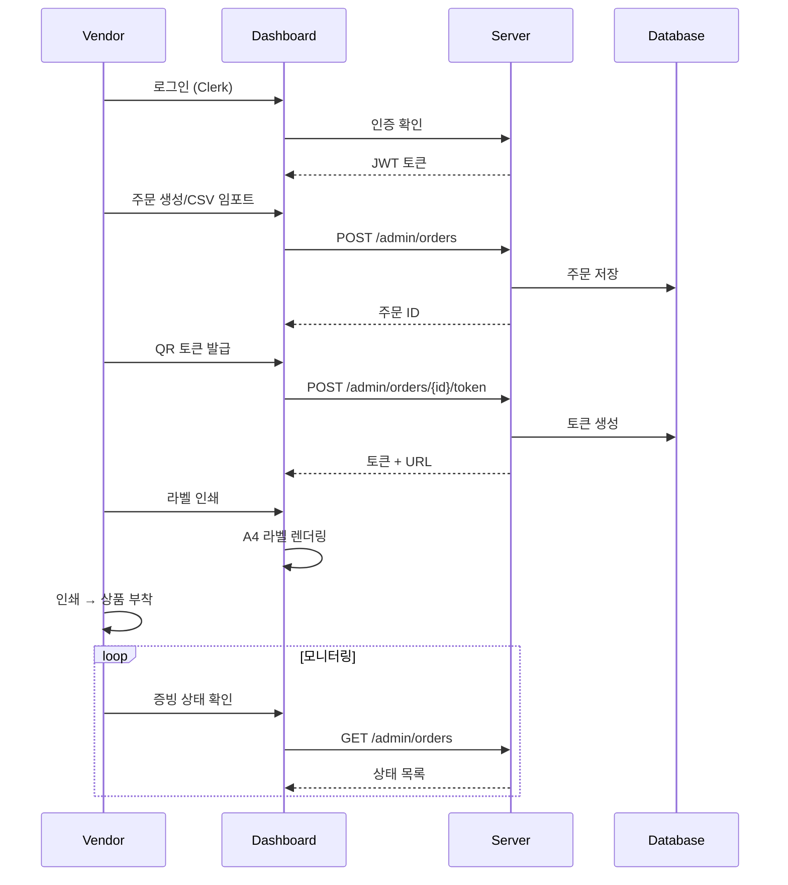
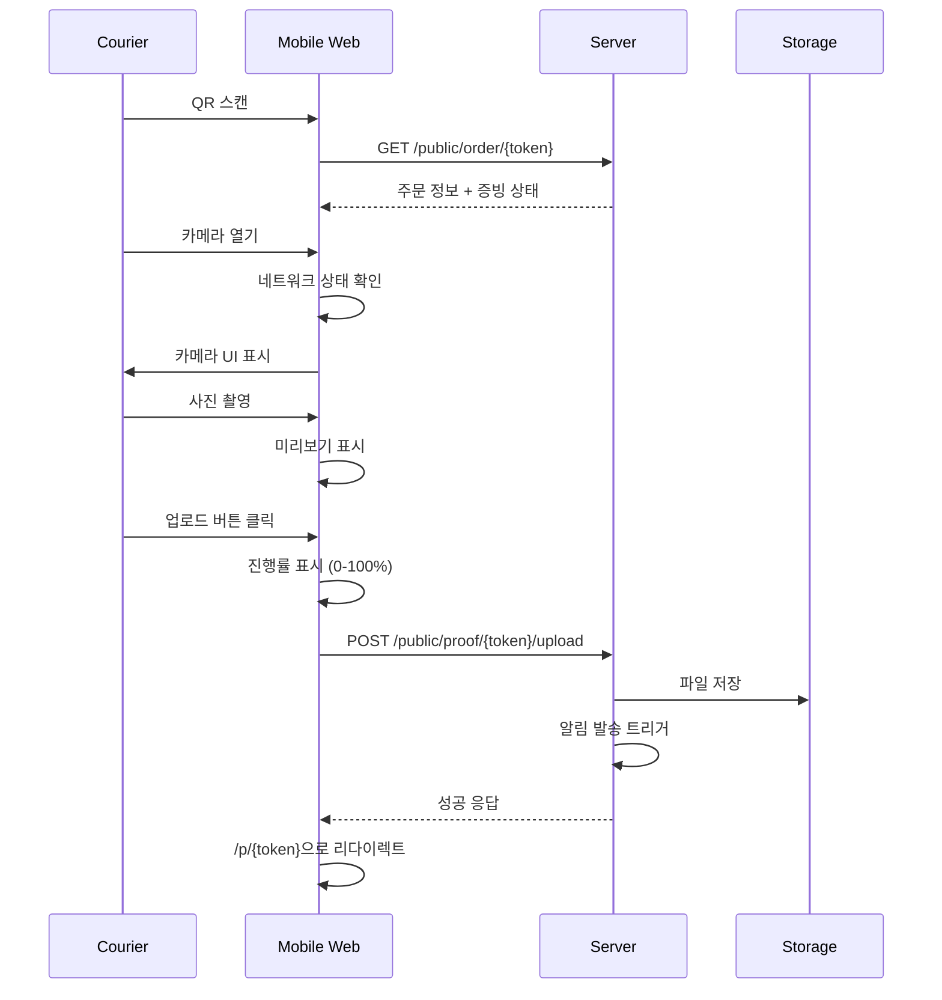
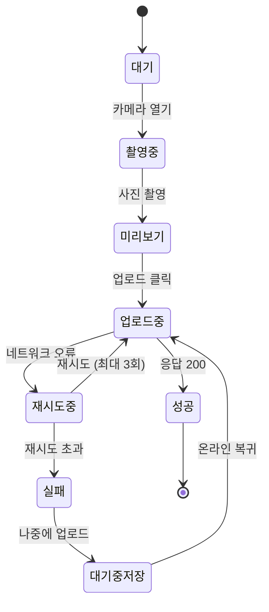
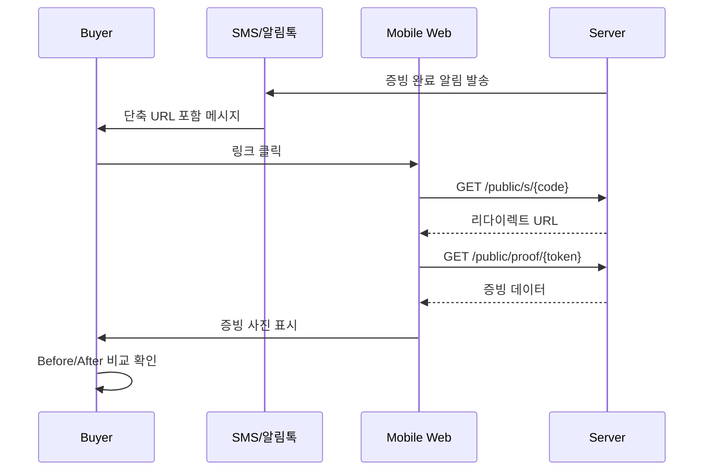
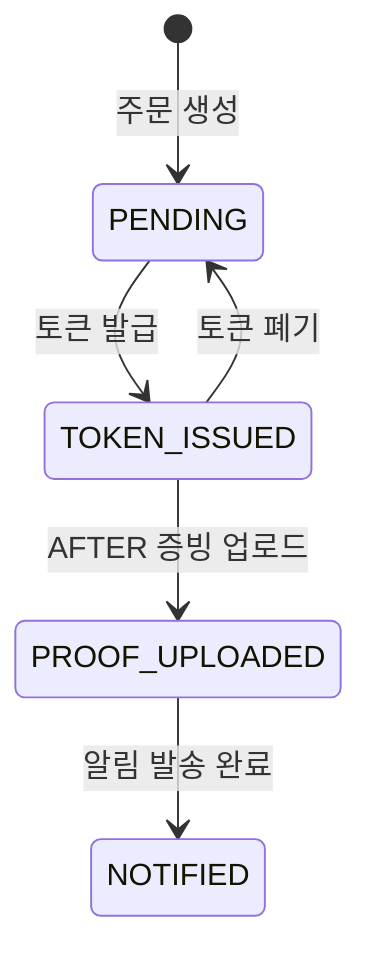
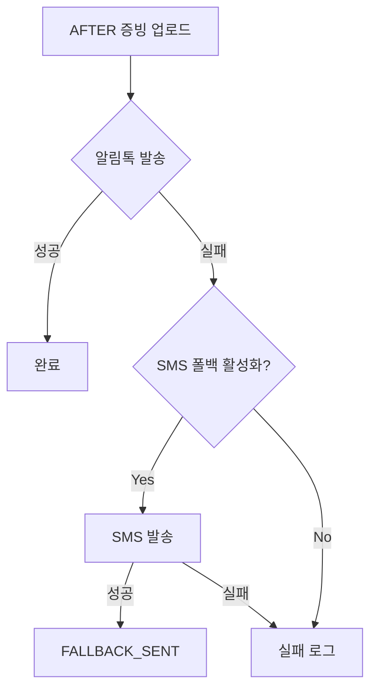

# 03. 사용자 플로우 (User Flows)

## 개요

ProofLink는 세 가지 주요 사용자 그룹을 지원합니다:
1. **Vendor (업체)**: 주문 관리, QR 발급, 증빙 모니터링
2. **Courier (현장 기사)**: QR 스캔, 사진 촬영, 업로드
3. **Buyer (구매자)**: 증빙 확인

---

## 1. Vendor CS / Ops 플로우

### 1.1 Happy Path

### 1.2 주요 작업

| 작업 | 페이지 | API | 설명 |
|------|--------|-----|------|
| 주문 생성 | `/app/orders/new` | `POST /admin/orders` | 단일 주문 수동 생성 |
| CSV 임포트 | `/app/orders` | `POST /admin/orders/import/csv` | 최대 100개 일괄 임포트 |
| 토큰 발급 | `/app/orders/[id]` | `POST /admin/orders/{id}/token` | QR 토큰 생성 |
| 라벨 인쇄 | `/app/labels` | `GET /admin/labels` | A4 2×5/2×6/2×7 템플릿 |
| 알림 재발송 | `/app/orders/[id]` | `POST /admin/orders/{id}/notify` | SMS/알림톡 재발송 |

### 1.3 에러 처리

| 상황 | 대응 |
|------|------|
| CSV 포맷 오류 | 행별 에러 메시지 표시, strict 모드 시 전체 롤백 |
| 토큰 중복 | `force=true`로 재발급 (이전 토큰 무효화) |
| 알림 발송 실패 | 발송 로그에 실패 사유 기록, SMS 폴백 시도 |

---

## 2. Courier / Partner Shop 플로우 (현장 증빙)

### 2.1 Happy Path (목표: 30초 이내)

### 2.2 시간 분석

| 단계 | 목표 시간 | 설명 |
|------|----------|------|
| QR 스캔 | 2-3초 | 카메라 앱 → URL 열기 |
| 페이지 로딩 | 2초 | 주문 정보 조회 |
| 카메라 열기 | 1초 | 버튼 탭 |
| 사진 촬영 | 3-5초 | 구도 잡기 + 촬영 |
| 미리보기 확인 | 2초 | 사진 확인 |
| 업로드 | 5-10초 | 네트워크 속도 의존 |
| **총합** | **15-23초** | 목표 30초 이내 |

### 2.3 v1.0.1 개선 사항

#### 업로드 진행률 표시
- XHR 기반 실시간 % 표시
- 상태: 준비 중 → 업로드 중 → 처리 중

#### 자동 재시도
- 네트워크 오류 시 최대 3회 재시도
- 지수 백오프: 1초 → 2초 → 4초

#### 네트워크 상태 감지
- 오프라인 시 업로드 버튼 비활성화
- 느린 네트워크 경고 표시

#### 오프라인 백업 (IndexedDB)
- 업로드 실패 시 "나중에 업로드" 옵션
- 온라인 복귀 시 자동 동기화

### 2.4 에러 처리

| 에러 | 메시지 | 대응 |
|------|--------|------|
| `RATE_LIMITED` | "요청이 너무 많습니다" | 잠시 후 재시도 |
| `NETWORK_ERROR` | "네트워크 오류" | 자동 재시도 또는 오프라인 저장 |
| `TIMEOUT` | "시간 초과" | 자동 재시도 |
| `TOKEN_INVALID` | "유효하지 않은 링크" | 업체에 문의 안내 |
| `Already uploaded` | "이미 업로드됨" | 확인 페이지로 리다이렉트 |

---

## 3. Buyer / Recipient 플로우 (증빙 확인)

### 3.1 Happy Path

### 3.2 페이지 기능

| 기능 | 설명 |
|------|------|
| Before/After 슬라이더 | 드래그로 수선 전/후 비교 |
| 원본 열기 | 전체 해상도 이미지 |
| 링크 복사 | 클립보드 복사 |
| 공유 | Web Share API (모바일) |

### 3.3 에러 처리

| 상황 | 표시 |
|------|------|
| 토큰 무효 | "유효하지 않은 링크입니다" + 업체 연락처 |
| 증빙 미업로드 | "아직 증빙이 업로드되지 않았습니다" |
| 404 | 커스텀 404 페이지 |

---

## 4. 상태 전환 다이어그램

### 4.1 주문 상태

| 상태 | 설명 |
|------|------|
| `PENDING` | 주문 생성됨, 토큰 미발급 |
| `TOKEN_ISSUED` | QR 토큰 발급됨 |
| `PROOF_UPLOADED` | AFTER 증빙 업로드 완료 |
| `NOTIFIED` | 구매자 알림 발송 완료 |

### 4.2 증빙 유형

| 유형 | 필수 | 설명 |
|------|------|------|
| `BEFORE` | 선택 | 수선 전 사진 |
| `AFTER` | 필수 | 수선 후 사진 (알림 트리거) |
| `RECEIPT` | 선택 | 영수증 |
| `DAMAGE` | 선택 | 손상 부위 기록 |
| `OTHER` | 선택 | 기타 증빙 |

---

## 5. 알림 플로우

### 5.1 알림 발송 순서

### 5.2 알림 상태

| 상태 | 설명 |
|------|------|
| `PENDING` | 발송 대기 |
| `SENT` | 발송 성공 |
| `FAILED` | 발송 실패 |
| `FALLBACK_SENT` | SMS 폴백 성공 |
| `MOCK_SENT` | 개발 모드 (실제 미발송) |

---

## 6. 보안 고려사항

### 6.1 토큰 정책
- QR에는 토큰만 포함 (PII 금지)
- 토큰: 12자 URL-safe 랜덤 문자열
- AFTER 업로드 완료 시 토큰 무효화

### 6.2 PII 처리
- 전화번호: AES-256 암호화 저장
- 공개 페이지: 전화번호 미노출
- 로그: 마스킹 처리

### 6.3 Rate Limiting
- Public API: 분당 60회
- 초과 시 429 응답

---

## 7. 관련 파일

### 프론트엔드
- `/web/src/pages/proof/[token].tsx` - 증빙 업로드
- `/web/src/pages/p/[token].tsx` - 증빙 확인
- `/web/src/components/UploadForm.tsx` - 업로드 폼
- `/web/src/hooks/useNetworkStatus.ts` - 네트워크 감지
- `/web/src/utils/offlineStorage.ts` - IndexedDB 저장소

### 백엔드
- `/server/src/api/routes/public.py` - 공개 API
- `/server/src/services/proof_service.py` - 증빙 서비스
- `/server/src/services/notification_service.py` - 알림 서비스
