# Saegim 유저 플로우 정의서

> 전체 사용자 여정 및 시스템 플로우 문서

---

## 1. 시스템 개요

### 1.1 전체 플로우 다이어그램

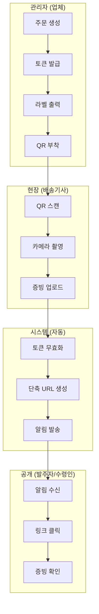

### 1.2 주요 액터

| 액터 | 설명 | 주요 화면 |
|------|------|-----------|
| **관리자** | 업체 사장님, 운영자 | 대시보드, 주문관리, 라벨출력 |
| **현장 사용자** | 배송기사, 수선 기사 | 업로드 페이지 (모바일) |
| **발주자** | 주문을 넣은 고객사 담당자 | 증빙 확인 페이지 |
| **수령인** | 최종 수령자 | 증빙 확인 페이지 |

---

## 2. Public Flow (현장 사용자)

### 2.1 증빙 업로드 플로우

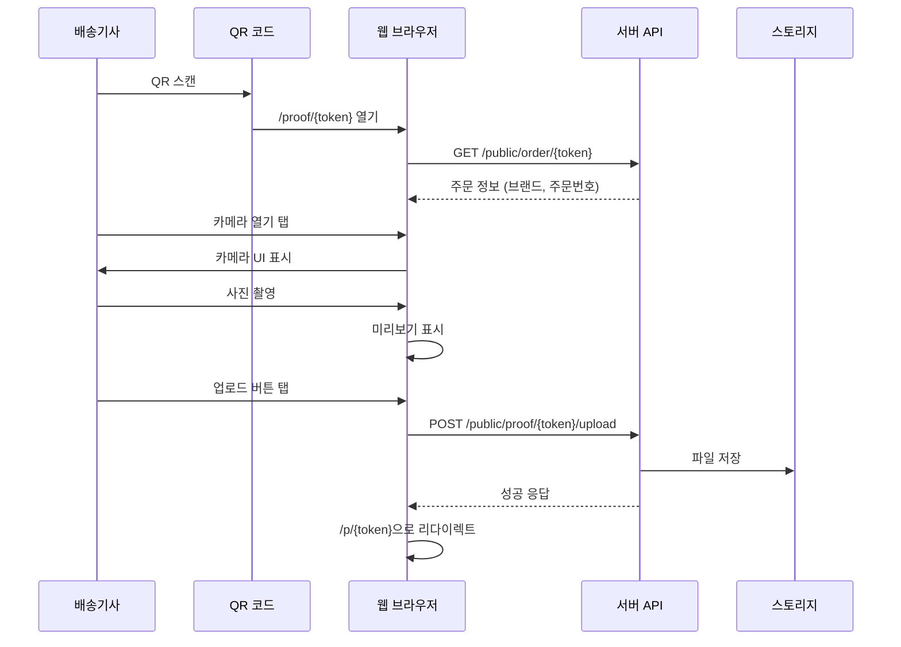

#### 진입점
- **QR 코드**: 라벨에 인쇄된 QR 스캔
- **직접 URL**: `{domain}/proof/{token}`

#### 관련 파일
| 파일 | 역할 |
|------|------|
| `web/src/pages/proof/[token].tsx` | 업로드 페이지 |
| `web/src/components/UploadForm.tsx` | 업로드 폼 컴포넌트 |
| `server/src/api/routes/public.py` | API 엔드포인트 |
| `server/src/services/proof_service.py` | 업로드 처리 로직 |

#### API 엔드포인트
| 메서드 | 경로 | 설명 |
|--------|------|------|
| GET | `/public/order/{token}` | 주문 정보 조회 |
| POST | `/public/proof/{token}/upload` | 증빙 업로드 |

#### 증빙 유형
| 타입 | 설명 | 트리거 |
|------|------|--------|
| BEFORE | 수선 전 사진 | 알림 발송 없음 |
| AFTER | 수선 후 사진 | **알림 자동 발송** |
| RECEIPT | 영수증 | 알림 발송 없음 |
| DAMAGE | 손상 부위 | 알림 발송 없음 |
| OTHER | 기타 | 알림 발송 없음 |

#### 오프라인 지원
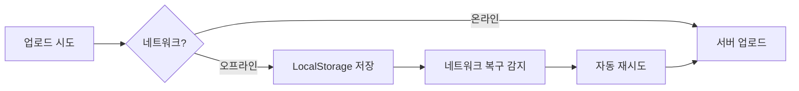

- **저장 키**: `saegim_pending_uploads`
- **자동 재시도**: `online` 이벤트 감지 시
- **수동 재시도**: 재시도 버튼 제공

---

### 2.2 증빙 확인 플로우

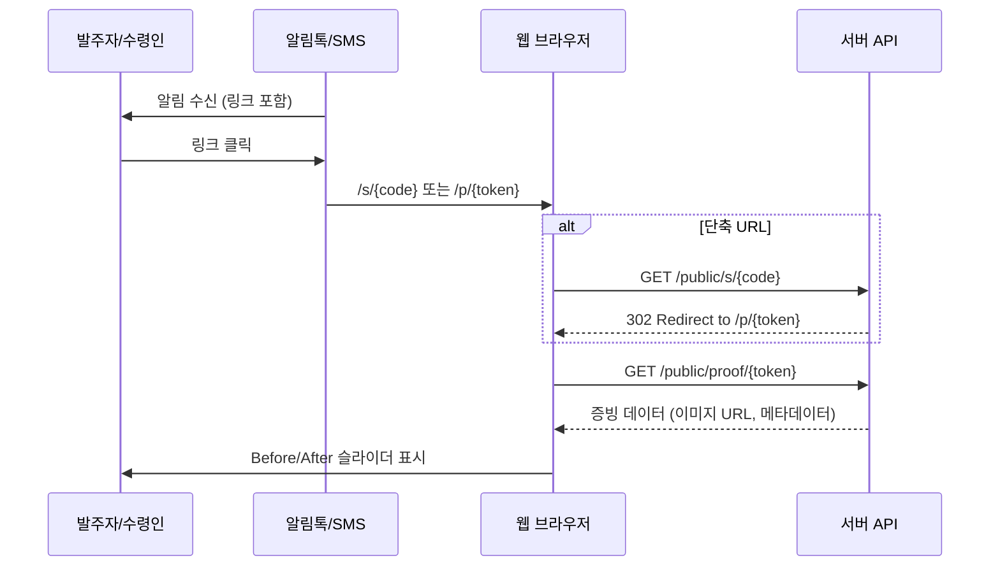

#### 진입점
- **알림톡/SMS**: 발송된 링크 클릭
- **직접 URL**: `{domain}/p/{token}` 또는 `{domain}/s/{code}`

#### 관련 파일
| 파일 | 역할 |
|------|------|
| `web/src/pages/p/[token].tsx` | 증빙 확인 페이지 |
| `web/src/components/BeforeAfterSlider.tsx` | 전/후 비교 슬라이더 |

#### 페이지 기능
- Before/After 이미지 슬라이더 (둘 다 있을 경우)
- 이미지 다운로드
- 링크 복사
- 네이티브 공유 (모바일)

---

## 3. Admin Flow (관리자)

### 3.1 인증 플로우

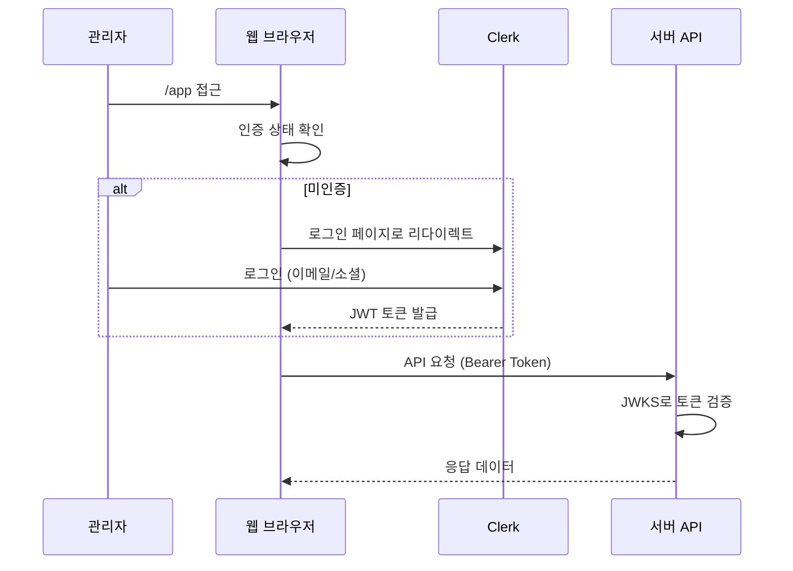

#### 관련 파일
| 파일 | 역할 |
|------|------|
| `web/src/pages/sign-in/[[...index]].tsx` | 로그인 페이지 |
| `web/src/services/useAdminToken.ts` | 인증 훅 |
| `server/src/api/deps.py` | 서버 인증 미들웨어 |

---

### 3.2 대시보드 플로우

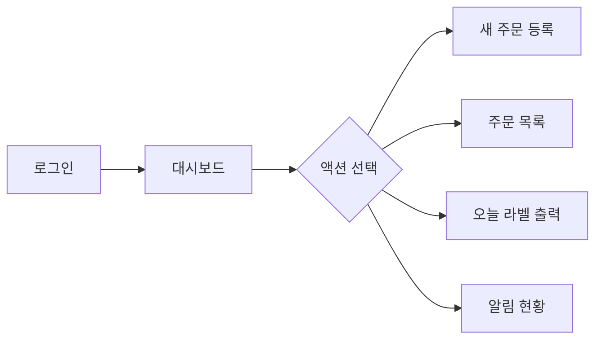

#### 관련 파일
| 파일 | 역할 |
|------|------|
| `web/src/pages/app/index.tsx` | 대시보드 페이지 |

#### KPI 카드
| 항목 | 설명 |
|------|------|
| 총 주문 | 기간 내 전체 주문 수 |
| 증빙 대기 | 아직 업로드되지 않은 주문 |
| 증빙 완료 | 업로드 완료된 주문 |
| 알림 실패 | 발송 실패한 알림 수 |

---

### 3.3 주문 관리 플로우

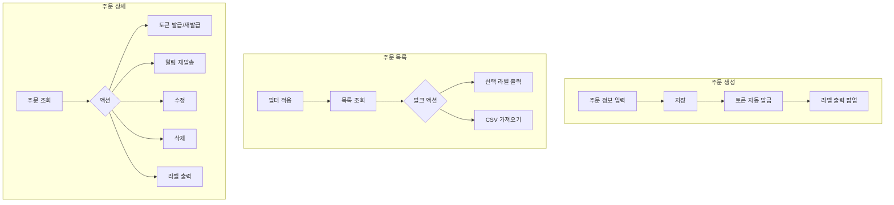

#### 주문 생성
| 필드 | 필수 | 설명 |
|------|------|------|
| order_number | O | 주문번호 |
| context | X | 용도 (예: 근조, 개업) |
| sender_name | O | 발주자 이름 |
| sender_phone | O | 발주자 전화번호 |
| recipient_name | X | 수령인 이름 |
| recipient_phone | X | 수령인 전화번호 |

#### CSV 가져오기 형식
```csv
order_number,context,sender_name,sender_phone,recipient_name,recipient_phone
ORD-001,근조화환,홍길동,01012345678,고인상주,01087654321
```

#### 관련 파일
| 파일 | 역할 |
|------|------|
| `web/src/pages/app/orders/new.tsx` | 주문 생성 |
| `web/src/pages/app/orders/index.tsx` | 주문 목록 |
| `web/src/pages/app/orders/[id].tsx` | 주문 상세 |
| `web/src/pages/app/labels.tsx` | 라벨 출력 |

---

### 3.4 라벨 출력 플로우

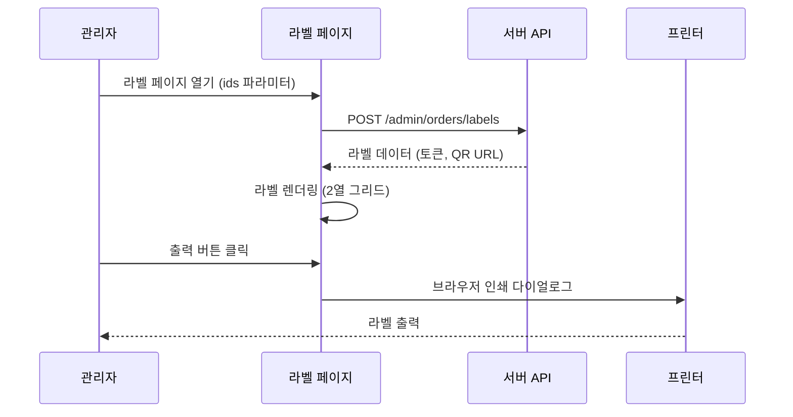

#### URL 파라미터
| 파라미터 | 설명 |
|----------|------|
| `ids` | 쉼표 구분 주문 ID |
| `mode=today` | 오늘 생성된 전체 주문 |
| `template` | 10(2x5), 12(2x6), 14(2x7) |
| `cut=1` | 절취선 표시 |
| `autoprint=1` | 자동 인쇄 다이얼로그 |
| `mini=1` | 컴팩트 레이아웃 |

---

### 3.5 알림 모니터링 플로우

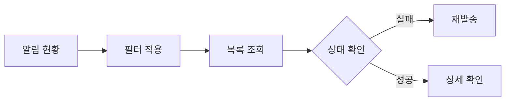

#### 필터 옵션
| 필터 | 옵션 |
|------|------|
| 날짜 | 오늘, 어제, 7일, 전체 |
| 상태 | 전체, SENT, FAILED, PENDING |
| 채널 | 전체, ALIMTALK, SMS |

#### 관련 파일
| 파일 | 역할 |
|------|------|
| `web/src/pages/app/notifications/index.tsx` | 알림 모니터링 |

---

## 4. System Flow (자동화)

### 4.1 알림 발송 플로우

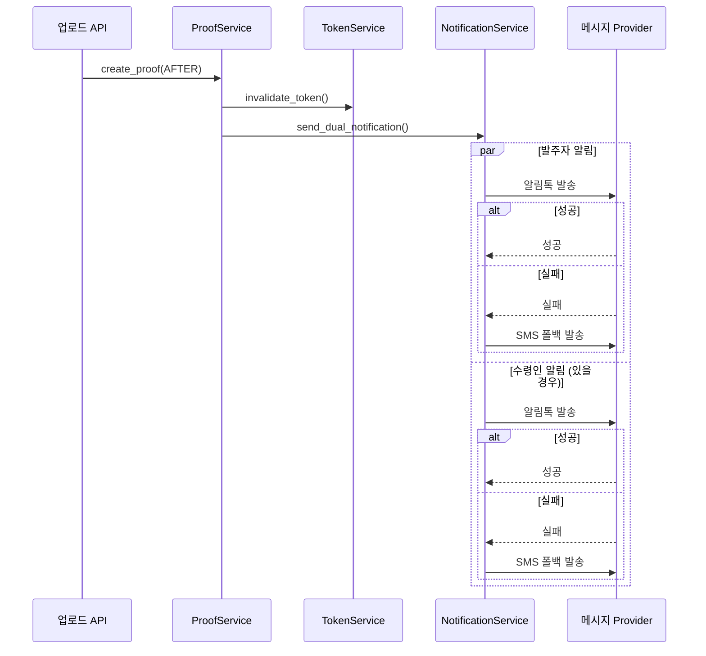

#### 트리거 조건
- **AFTER 타입** 증빙 업로드 시에만 알림 발송
- BEFORE, RECEIPT, DAMAGE, OTHER는 알림 없음

#### 알림 채널
| 채널 | 우선순위 | 설명 |
|------|----------|------|
| 알림톡 | 1순위 | 카카오 비즈메시지 |
| SMS | 폴백 | 알림톡 실패 시 자동 전환 |

#### 관련 파일
| 파일 | 역할 |
|------|------|
| `server/src/services/notification_service.py` | 알림 발송 로직 |
| `server/src/services/message_render.py` | 템플릿 렌더링 |

---

### 4.2 상태 전이 다이어그램

#### Order Status
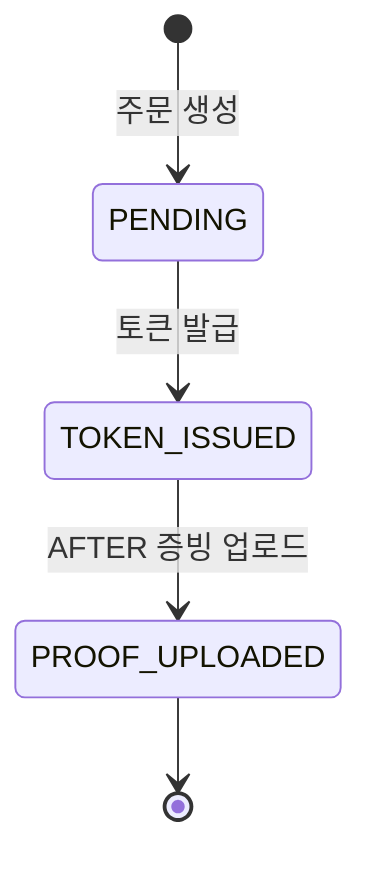

#### QR Token
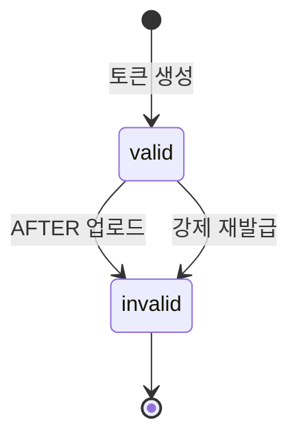

#### Notification Status
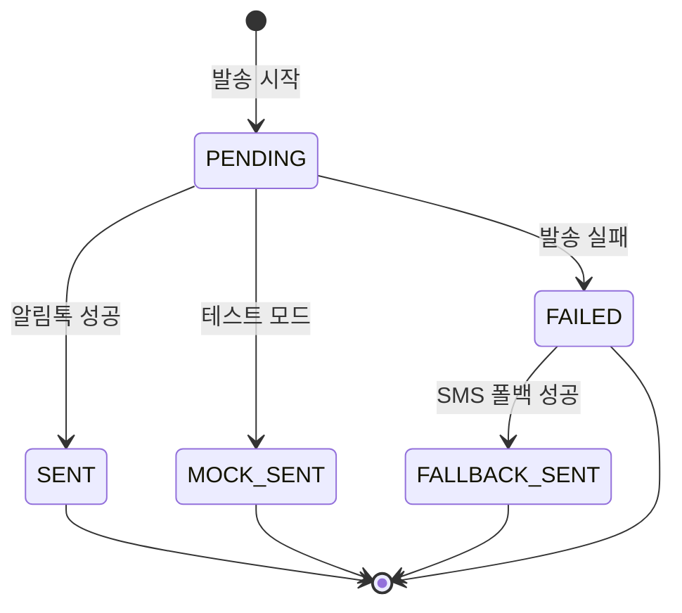

---

## 5. 에러 케이스 및 대체 경로

### 5.1 Public Flow 에러

| 상황 | 에러 코드 | 사용자 경험 | 대체 경로 |
|------|-----------|-------------|-----------|
| 만료/무효 토큰 | `TOKEN_INVALID` | 에러 페이지 표시 | 업체 연락 안내 |
| 파일 크기 초과 | `UPLOAD_FAILED` | 10MB 초과 안내 | 파일 압축 후 재시도 |
| 잘못된 파일 형식 | `Invalid file type` | 이미지만 허용 안내 | 다른 파일 선택 |
| 이미 업로드됨 | `already uploaded` | 자동 확인 페이지 이동 | - |
| 네트워크 오류 | - | 오프라인 저장 알림 | 자동 재시도 |
| 카메라 권한 거부 | - | OS별 설정 안내 | 새로고침 후 재시도 |

### 5.2 Admin Flow 에러

| 상황 | 에러 코드 | 사용자 경험 | 대체 경로 |
|------|-----------|-------------|-----------|
| 미인증 접근 | `401` | 로그인 리다이렉트 | 로그인 후 복귀 |
| 권한 없음 | `FORBIDDEN` | 권한 부족 메시지 | 관리자 문의 |
| 조직 미설정 | `ORG_REQUIRED` | 조직 가입 안내 | Clerk에서 조직 가입 |
| 주문 미존재 | `404` | 목록 이동 안내 | 주문 목록으로 이동 |
| 중복 주문번호 | `DUPLICATE` | 중복 안내 | 다른 번호 입력 |
| API 오류 | `500` | 일시적 오류 안내 | 새로고침 |

### 5.3 System Flow 에러

| 상황 | 처리 방식 | 관리자 조치 |
|------|-----------|-------------|
| 알림톡 발송 실패 | SMS 폴백 자동 시도 | 필요 시 수동 재발송 |
| SMS 발송 실패 | FAILED 상태 기록 | 알림 현황에서 재발송 |
| 전화번호 복호화 실패 | 에러 로깅, 알림 스킵 | 주문 정보 확인 |
| 스토리지 오류 | 업로드 실패 응답 | 스토리지 설정 확인 |

---

## 6. API 엔드포인트 요약

### 6.1 Public API (인증 불필요)

| 메서드 | 경로 | 설명 |
|--------|------|------|
| GET | `/public/order/{token}` | 토큰으로 주문 조회 |
| POST | `/public/proof/{token}/upload` | 증빙 업로드 |
| GET | `/public/proof/{token}` | 증빙 데이터 조회 |
| GET | `/public/s/{code}` | 단축 URL 리다이렉트 |

### 6.2 Admin API (인증 필요)

| 메서드 | 경로 | 설명 |
|--------|------|------|
| GET | `/admin/me` | 현재 사용자 정보 |
| GET | `/admin/dashboard` | 대시보드 KPI |
| GET | `/admin/orders` | 주문 목록 |
| POST | `/admin/orders` | 주문 생성 |
| GET | `/admin/orders/{id}` | 주문 상세 |
| PATCH | `/admin/orders/{id}` | 주문 수정 |
| DELETE | `/admin/orders/{id}` | 주문 삭제 |
| POST | `/admin/orders/{id}/token` | 토큰 발급 |
| POST | `/admin/orders/{id}/notify` | 알림 재발송 |
| POST | `/admin/orders/labels` | 라벨 데이터 조회 |
| POST | `/admin/orders/import/csv` | CSV 가져오기 |
| GET | `/admin/notifications` | 알림 목록 |
| GET | `/admin/notifications/stats` | 알림 통계 |

---

## 7. 업그레이드 로드맵

### 7.1 Public Flow 개선

| 현재 | 개선안 | 우선순위 | 난이도 |
|------|--------|----------|--------|
| 단일 사진 업로드 | 다중 사진 업로드 (갤러리) | 중 | 중 |
| 이미지만 지원 | 동영상 증빙 (15초) | 하 | 상 |
| 수동 촬영 | AI 자동 프레이밍 | 하 | 상 |
| 웹 전용 | PWA 설치형 | 중 | 중 |
| 기본 뷰어 | 줌/핀치 제스처 | 중 | 하 |

### 7.2 Admin Flow 개선

| 현재 | 개선안 | 우선순위 | 난이도 |
|------|--------|----------|--------|
| CSV 수동 가져오기 | 쇼핑몰/POS API 연동 | 상 | 상 |
| 단일 주문 생성 | 대량 주문 생성 UI | 중 | 중 |
| 기본 검색 | 고급 필터 UI | 중 | 하 |
| 개별 라벨 출력 | 배치 예약 출력 | 중 | 중 |
| 단일 조직 | 다중 조직 전환 | 상 | 중 |
| 웹 대시보드 | 모바일 관리자 앱 | 하 | 상 |

### 7.3 알림 개선

| 현재 | 개선안 | 우선순위 | 난이도 |
|------|--------|----------|--------|
| 완료 후 알림 | 리마인더 알림 | 중 | 중 |
| 알림톡/SMS | 이메일 채널 | 하 | 중 |
| 고정 템플릿 | 커스텀 편집기 | 상 | 상 |
| 수동 재발송 | 자동 재시도 (3회) | 중 | 하 |

### 7.4 명품 수선 피벗 준비

| 항목 | 개선안 | 우선순위 |
|------|--------|----------|
| 자산 메타데이터 | 브랜드/모델/소재/색상 확장 | 상 |
| 수선 상태 트래킹 | 접수→진단→수선→완료 워크플로우 | 상 |
| 고객 포털 | 수선 현황 조회 페이지 | 중 |
| 가격 견적 | 견적서 생성/승인 플로우 | 중 |
| 결제 연동 | Stripe/토스 게이트웨이 | 중 |

---

## 8. 파일 구조 참조

### Frontend (web/)

```
src/
├── pages/
│   ├── proof/[token].tsx      # 업로드 페이지
│   ├── p/[token].tsx          # 증빙 확인
│   ├── sign-in/[[...index]].tsx
│   └── app/
│       ├── index.tsx          # 대시보드
│       ├── orders/
│       │   ├── index.tsx      # 주문 목록
│       │   ├── new.tsx        # 주문 생성
│       │   └── [id].tsx       # 주문 상세
│       ├── notifications/
│       │   └── index.tsx      # 알림 모니터링
│       └── labels.tsx         # 라벨 출력
├── components/
│   ├── UploadForm.tsx         # 업로드 폼
│   ├── BeforeAfterSlider.tsx  # 전/후 슬라이더
│   └── AdminLayout.tsx        # 관리자 레이아웃
└── services/
    ├── api.ts                 # Public API
    ├── adminApi.ts            # Admin API
    └── useAdminToken.ts       # 인증 훅
```

### Backend (server/)

```
src/
├── api/routes/
│   ├── public.py              # Public 엔드포인트
│   └── admin.py               # Admin 엔드포인트
├── services/
│   ├── proof_service.py       # 증빙 처리
│   ├── notification_service.py# 알림 발송
│   ├── admin_service.py       # 관리자 로직
│   ├── token_service.py       # 토큰 관리
│   └── short_link_service.py  # 단축 URL
└── models/
    ├── order.py               # Order 모델
    ├── proof.py               # Proof 모델
    ├── qr_token.py            # QRToken 모델
    └── notification.py        # Notification 모델
```
